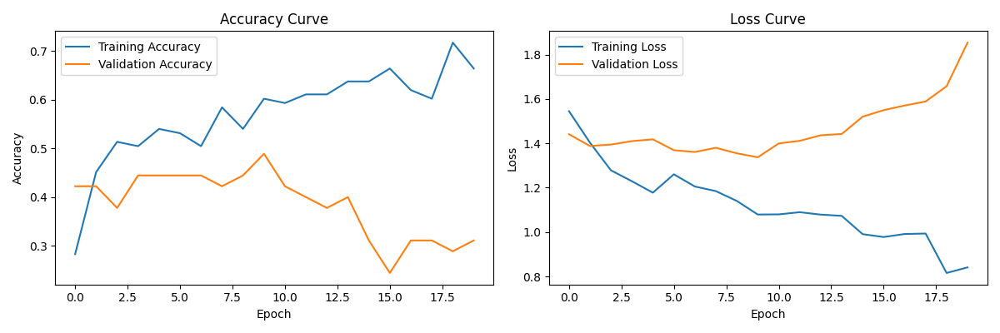
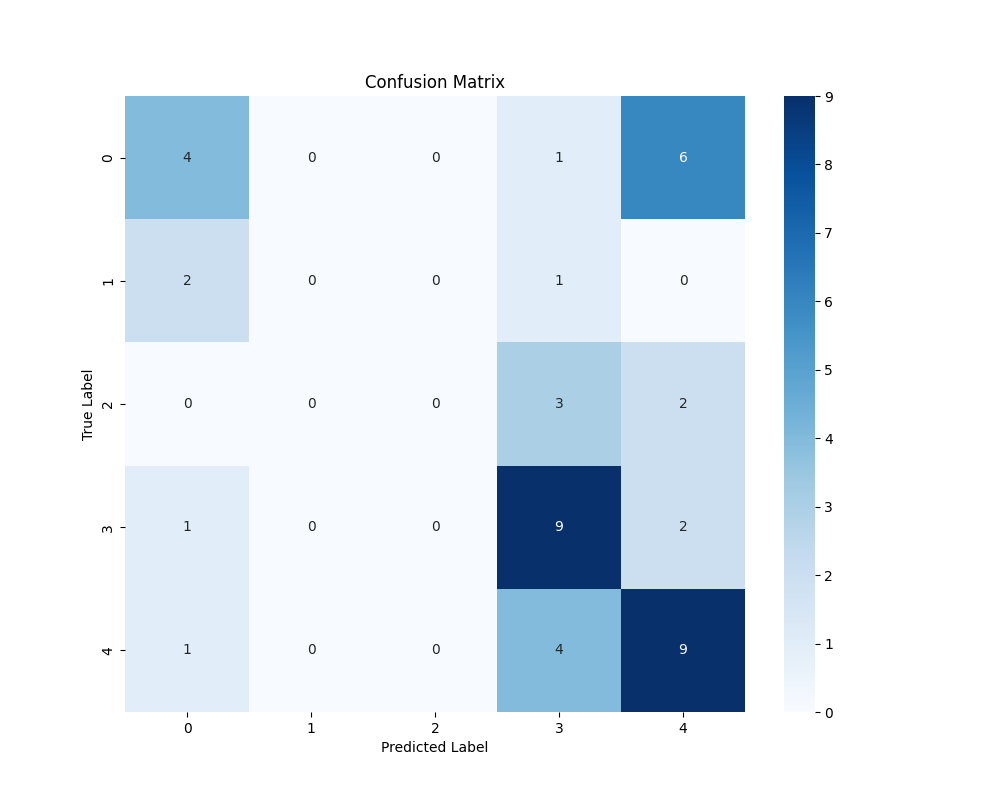

# Human Activity Recognition using CNN-LSTM

This project implements a hybrid deep learning model combining Convolutional Neural Networks (CNN) and Long Short-Term Memory (LSTM) networks for human activity recognition using sensor data from smartphones.

## 🎯 Features

- Hybrid CNN-LSTM architecture for robust activity recognition
- Real-time activity prediction capability
- Comprehensive model evaluation and visualization
- Support for UCI HAR Dataset
- Detailed performance metrics and visualizations

## 📊 Model Architecture

The model combines:
- CNN layers for spatial feature extraction
- LSTM layers for temporal pattern recognition
- Dense layers for final classification


## 📁 Project Structure

```
├── data/
│   ├── raw/          # Original UCI HAR Dataset
│   └── processed/    # Preprocessed data ready for training
├── model/
│   ├── cnn_lstm.py   # CNN-LSTM model implementation
│   └── predict.py    # Prediction script
├── notebooks/
│   └── har_cnn_lstm.ipynb  # Jupyter notebook for interactive development
├── output/
│   ├── best_model.h5       # Trained model
│   └── plots/             # Training and evaluation plots
└── utils/
    ├── preprocess.py      # Data preprocessing utilities
    └── download_data.py   # Dataset download script
```

## 🛠️ Requirements

- Python 3.x
- TensorFlow 2.x
- NumPy
- Pandas
- scikit-learn
- Matplotlib
- Seaborn
- OpenCV

Install dependencies:
```bash
pip install -r requirements.txt
```

## 🚀 Getting Started

1. Download the dataset:
```bash
python utils/download_data.py
```

2. Preprocess the data:
```bash
python utils/preprocess.py
```

3. Train the model:
```bash
python model/cnn_lstm.py
```

4. Make predictions:
```bash
python model/predict.py
```

## 📈 Results

### Training Performance



### Model Evaluation



### Classification Report
```